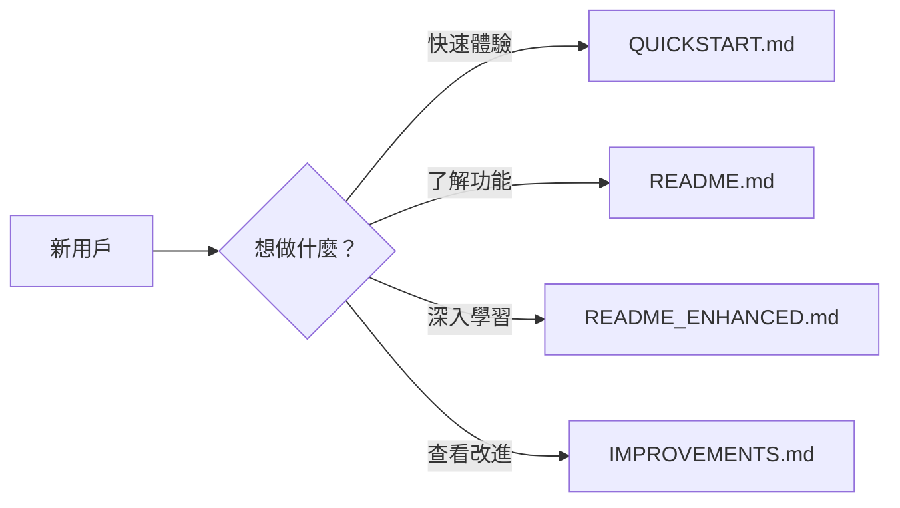

# 📖 文檔導航 Documentation Index

歡迎使用量化交易系統 v2.0！本文檔將幫助您快速找到需要的信息。

---

## 🚀 新用戶指南

### 我該從哪裡開始？



### 推薦閱讀順序

1. **⭐ 第一步：快速啟動** (5分鐘)
   - 📄 [QUICKSTART.md](QUICKSTART.md)
   - 內容：如何運行、第一次使用、基本操作

2. **📚 第二步：了解功能** (10分鐘)
   - 📄 [README.md](README.md)
   - 內容：功能概覽、技術架構、配置說明

3. **🔍 第三步：深入學習** (30分鐘)
   - 📄 [README_ENHANCED.md](README_ENHANCED.md)
   - 內容：完整API、詳細配置、開發指南

4. **💡 可選：技術細節**
   - 📄 [IMPROVEMENTS.md](IMPROVEMENTS.md)
   - 內容：v2.0改進、技術實現、性能數據

---

## 📚 完整文檔列表

### 用戶文檔

| 文檔 | 類型 | 難度 | 時間 | 說明 |
|------|------|------|------|------|
| [README.md](README.md) | 概覽 | ⭐ | 5分鐘 | 項目介紹和快速導航 |
| [QUICKSTART.md](QUICKSTART.md) | 教程 | ⭐ | 5分鐘 | 快速入門和常見案例 |
| [README_ENHANCED.md](README_ENHANCED.md) | 完整 | ⭐⭐ | 30分鐘 | 詳細的使用文檔 |

### 技術文檔

| 文檔 | 類型 | 難度 | 時間 | 說明 |
|------|------|------|------|------|
| [IMPROVEMENTS.md](IMPROVEMENTS.md) | 技術 | ⭐⭐⭐ | 20分鐘 | v2.0改進總結 |
| [PROJECT_SUMMARY.md](PROJECT_SUMMARY.md) | 總結 | ⭐⭐ | 10分鐘 | 項目完成總結 |
| [config.py](config.py) | 代碼 | ⭐⭐⭐ | - | 配置參考 |

### 配置文件

| 文件 | 類型 | 說明 |
|------|------|------|
| [.env.example](.env.example) | 範例 | 環境變數範本 |
| [requirements.txt](requirements.txt) | 依賴 | Python套件清單 |

---

## 🎯 根據需求查找

### 我想...

#### 🚀 快速開始使用
→ [QUICKSTART.md](QUICKSTART.md) - 第一次使用指南

#### 📊 查看有什麼功能
→ [README.md](README.md) - 功能特性章節

#### 🔌 使用API
→ [README_ENHANCED.md](README_ENHANCED.md#-api文檔) - API文檔章節

#### ⚙️ 配置系統
→ [README_ENHANCED.md](README_ENHANCED.md#-配置說明) - 配置說明
→ [.env.example](.env.example) - 環境變數範例

#### 🧪 運行測試
→ [test_enhancements.py](test_enhancements.py) - 測試腳本
```bash
python test_enhancements.py
```

#### 🐛 排查問題
→ [QUICKSTART.md](QUICKSTART.md#-常見問題) - 常見問題
→ 查看日誌：`logs/app.log`

#### 💻 開發新功能
→ [README_ENHANCED.md](README_ENHANCED.md#-開發指南) - 開發指南
→ [IMPROVEMENTS.md](IMPROVEMENTS.md) - 架構說明

#### 📈 了解性能改進
→ [IMPROVEMENTS.md](IMPROVEMENTS.md#-性能提升) - 性能數據

---

## 💡 使用場景索引

### 個人投資者

**我想分析股票**
1. [快速開始](QUICKSTART.md#案例1-分析台積電近期表現)
2. [技術分析API](README_ENHANCED.md#技術分析api)

**我想測試策略**
1. [回測教程](QUICKSTART.md#案例2-測試均線交叉策略)
2. [回測API](README_ENHANCED.md#回測api)

**我想管理投資組合**
1. [投資組合功能](QUICKSTART.md#4-管理投資組合)
2. [投資組合API](README_ENHANCED.md#投資組合api)

### 量化研究員

**我想批次分析**
1. [批次處理](QUICKSTART.md#案例4-批次分析多支股票)
2. [批次API](README_ENHANCED.md#批次處理api)

**我想優化參數**
1. [參數優化](QUICKSTART.md#案例3-優化策略參數)
2. [優化API](README_ENHANCED.md#參數優化)

**我想集成到系統**
1. [API文檔](README_ENHANCED.md#-api文檔)
2. [Python範例](QUICKSTART.md#python-腳本範例)

### 開發者

**我想了解架構**
→ [IMPROVEMENTS.md](IMPROVEMENTS.md#-核心改進詳情)

**我想添加功能**
→ [README_ENHANCED.md](README_ENHANCED.md#-開發指南)

**我想部署到生產**
→ [README_ENHANCED.md](README_ENHANCED.md#生產環境)

---

## 🔍 按主題查找

### 安裝和配置
- [快速安裝](QUICKSTART.md#-5分鐘快速啟動)
- [詳細安裝](README_ENHANCED.md#-安裝與運行)
- [環境配置](.env.example)
- [配置說明](IMPROVEMENTS.md#-配置管理系統)

### 功能使用
- [股票數據](README_ENHANCED.md#股票數據api)
- [技術分析](README_ENHANCED.md#技術分析api)
- [回測引擎](README_ENHANCED.md#回測api)
- [機器學習](README_ENHANCED.md#機器學習api)
- [投資組合](README_ENHANCED.md#投資組合api)
- [警報系統](README_ENHANCED.md#警報api)

### API參考
- [API概覽](README_ENHANCED.md#-api文檔)
- [Python範例](QUICKSTART.md#python-腳本範例)
- [JavaScript範例](QUICKSTART.md#javascript-範例)

### 技術細節
- [架構設計](IMPROVEMENTS.md#-技術架構)
- [性能優化](IMPROVEMENTS.md#-性能提升)
- [安全性](IMPROVEMENTS.md#-安全性增強)
- [錯誤處理](IMPROVEMENTS.md#2--增強的日誌系統)

### 問題排查
- [常見問題](QUICKSTART.md#-常見問題)
- [測試指南](test_enhancements.py)
- [日誌系統](IMPROVEMENTS.md#2--增強的日誌系統)

---

## 📱 快速參考

### 常用命令

```bash
# 啟動應用（增強版）
python startup.py --enhanced

# 啟動應用（指定環境）
python startup.py --env production

# 僅初始化
python startup.py --init-only

# 運行測試
python test_enhancements.py

# 查看日誌
tail -f logs/app.log

# Windows快速啟動
run.bat
```

### 常用API端點

```bash
# 健康檢查
GET /api/health

# 股票數據
GET /api/stock/2330?period=1y

# 技術分析
GET /api/analysis/2330?indicators=ma,rsi,macd

# 運行回測
POST /api/backtest

# 投資組合
GET /api/portfolio

# 創建警報
POST /api/alerts
```

### 環境變數

```env
# 基本設定
FLASK_ENV=development
DEBUG=True
HOST=0.0.0.0
PORT=5000

# 台灣股票
DEFAULT_SUFFIX=.TW

# 速率限制
RATELIMIT_ENABLED=True

# 日誌
LOG_LEVEL=INFO
```

---

## 🆘 需要幫助？

### 查找信息的步驟

1. **查看快速入門**
   - [QUICKSTART.md](QUICKSTART.md)

2. **查看常見問題**
   - [QUICKSTART.md - 常見問題](QUICKSTART.md#-常見問題)

3. **查看日誌文件**
   ```bash
   cat logs/app.log
   ```

4. **運行測試診斷**
   ```bash
   python test_enhancements.py
   ```

5. **查看完整文檔**
   - [README_ENHANCED.md](README_ENHANCED.md)

6. **查看技術文檔**
   - [IMPROVEMENTS.md](IMPROVEMENTS.md)

---

## 📞 聯繫與支持

- 📧 GitHub Issues
- 📖 完整文檔：[README_ENHANCED.md](README_ENHANCED.md)
- 🚀 快速入門：[QUICKSTART.md](QUICKSTART.md)

---

## 🔄 文檔版本

- **當前版本**: 2.0.0
- **更新日期**: 2026-01-08
- **文檔語言**: 繁體中文 + English

---

<div align="center">

**找到您需要的信息了嗎？**

[開始使用](QUICKSTART.md) • [查看功能](README.md) • [完整文檔](README_ENHANCED.md)

**祝您使用愉快！Happy Trading! 📈**

</div>
